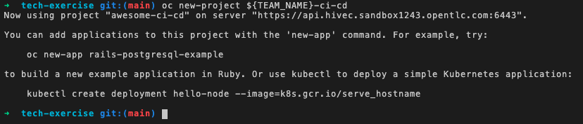

## The basics
[TODO] - update pics!!! 

## Getting Setup

1. Setup your `<TEAM_NAME>` name in the bash environment by running the command below. We will use the `TEAM_NAME` variable throughout the exercises so having it stored in our session means less changing of this variable throughout the exercises 💪.
```bash
echo export TEAM_NAME="<TEAM_NAME>" | tee ~/.bashrc 
```

2. Set the `CLUSTER_DOMAIN`. This needs to be based on the cluster name the cluster was installed with:
```bash
echo export CLUSTER_DOMAIN="<CLUSTER_DOMAIN>" | tee -a ~/.bashrc -a ~/.zshrc
```

3. Verify the variables you have set:
```bash
source ~/.bashrc
echo ${CLUSTER_DOMAIN}
echo ${TEAM_NAME}
```

4. Check if you can connect to OpenShift. Run the command below. 
```bash
oc login --server=https://api.${CLUSTER_DOMAIN}:6443 -u <USERNAME> -p <PASSWORD>
```

5. Check your user permissions in OpenShift by creating your team's first project. 
```bash
oc new-project ${TEAM_NAME}-project
```
